# Laporan Praktikum 1 - Sistem Administrasi Server 
Disusun oleh :
1. Chintya Tribhuana Utami (1202190041)
2. Nur Wulan Maudini (1202190002)


# ______________________________________

Praktikum dikerjakan berdasarkan skema yang tertera di soal dan soal dapat diakses [Klik Disini.](https://github.com/aldonesia/Sistem-Administrasi-Server-2021/blob/master/modul-1/soal_praktikum.md)
#  ______________________________________
Pada pelaksanaan pengerjaan soal praktikum , kita melakukan perubahan dengan keadaan awal latihan soal praktikum sebelumnya dengan soal praktikum yang sudah diberikan kali ini.
#
#
### Soal 1. Rename ubuntu_php5.6 menjadi ubuntu_landing, serta rubah IP mengikuti skema yang baru
___
- Menampilkan list LXC untuk mengecek sebelum di rename
    ```
    sudo lxc -ls -f
    ```  
    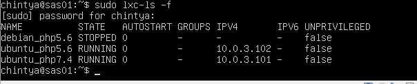

- Stop service ubuntu_php5.6 sebelum rename

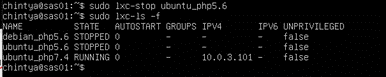

- Rename lxc
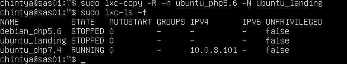

- Attach  dan start ubuntu landing


- Ganti ip 103
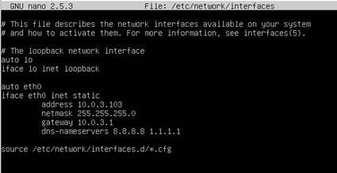
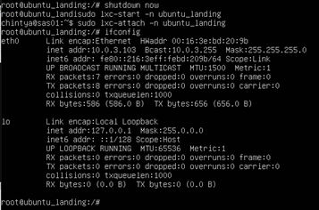

- Cek setting ip dari vm
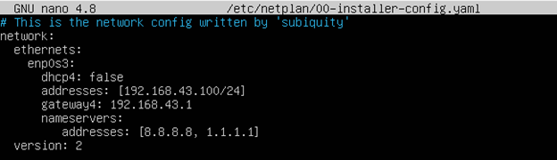

- Cek apakah bisa tersambung internet
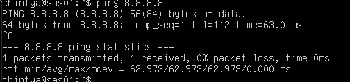

- Mengganti ip static ke dhcp lagi untuk download repositori dari Debian
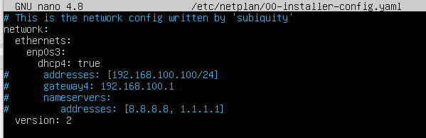

- Mengganti sources list ubuntu
    ```
    sudo nano /etc/apt/sources.list
    ```


### Soal 2. Install lxc debian 9 dengan nama debian_php5.6
- Install lxc Debian 9
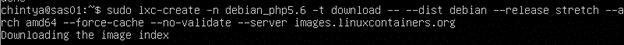
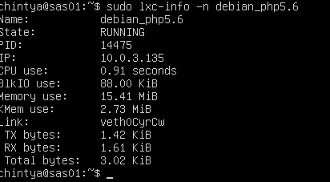
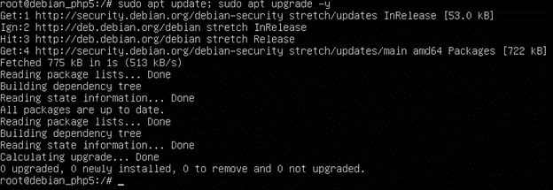
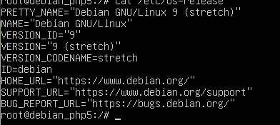

### Soal 3. setup nginx pada debian_php5.6 untuk domain http://lxc_php5.dev , buat halaman index.html yang menerangkan informasi nama lxc
- Exit ubuntu landing, start dan attach Debian, install nginx extra
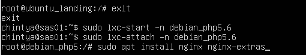

- Install curl dan setting ip
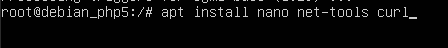
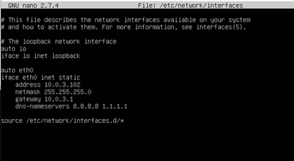
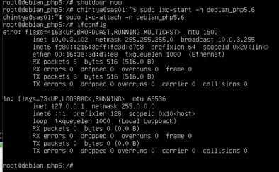

- Masuk ke sites available buat file lxc5.6.dev
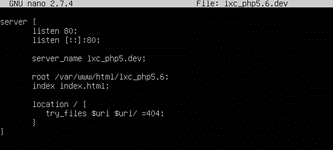

- Buat symlink dan tes nginx
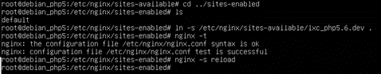

- Setting hosts
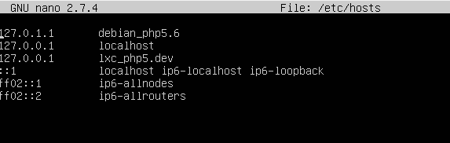

- Masuk var/www/html, copy, edit index di folder php5.6
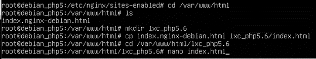
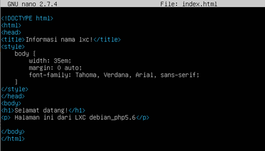

- Cek http lxc_php5.dev
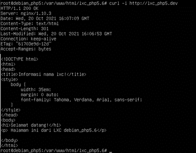

### Soal 4. setup nginx pada ubuntu_landing untuk domain http://lxc_landing.dev , buat halaman index.html yang menerangkan informasi nama lxc
- Masuk direktori ubuntu landing
- Masuk sites-available edit lxc_php5.6.dev


- Edit server name di sites-available php5.6.dev
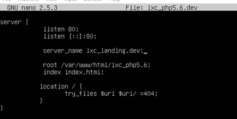

- Tes nginx di sites-enabled dan reload nginx edit hosts
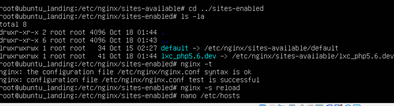

- Ubah ip hosts lxc landing
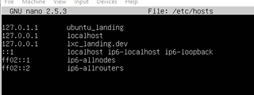

- Cek index yg sdh ada sebelum e diganti
 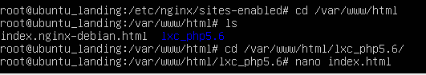

- Edit index.html
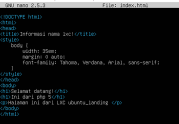

- Cek curl (http://lxc_landing.dev)
 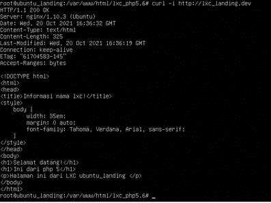

- Keluar terlebih dahulu lalu stop service ubuntu landing
 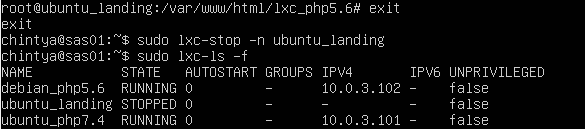

- Masuk root dan var lib lxc cari ubuntu landing cofig
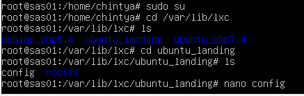

### Soal 5. LXC ubuntu_landing harus auto start ketika vm dinyalakan, hal ini digunakan untuk menjaga agar website company profile tidak mengalami downtime
- Tambahkan kode autostart 1
 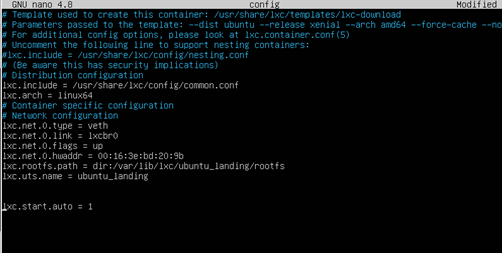

- Cek apa sudah nyala saat boot
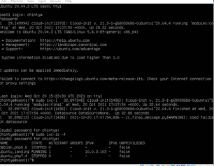

### Soal 6. setup nginx pada vm.local untuk mengatur proxy_pass dimana :
- mengakses http://vm.local akan diarahkan ke http://lxc_landing.dev
- mengakses http://vm.local/blog akan diarahkan ke http://lxc_php7.dev
- mengakses http://vm.local/app akan diartahkan ke http://lxc_php5.dev
    - Setting hosts
    

- Edit vm.local di sites-available
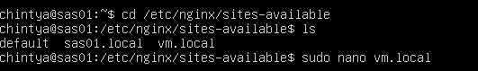
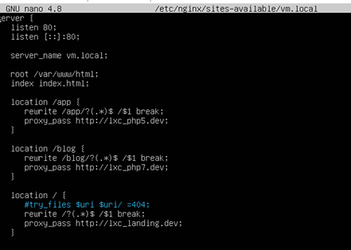

- Masuk sites-enabled reset nginx
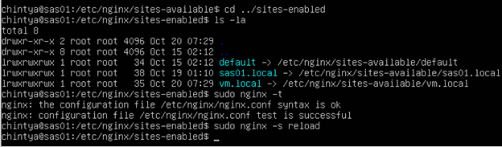

### Soal 7. untuk kebutuhan presentasi mereka, browser di laptop mereka harus dapat mengakses ketiga url tersebut.

- Cek di curl
- Konfigurasi ip hosts laptop

    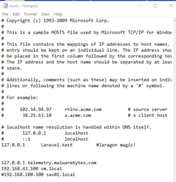

- Coba browser

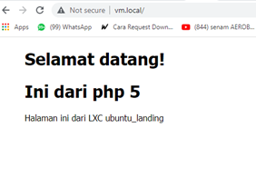
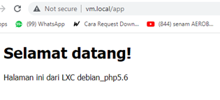
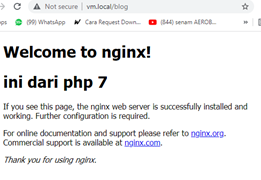


### Soal 8. Menyiapkan analisa untuk diserahkan ke CTO
 - mengapa untuk kebutuhan php5.6 tidak bisa menggunakan ubuntu 16.04, sehingga perlu diganti os ke debian 9?
    - Karena Ubuntu 16.04 xenial sudah mencapai akhir versi dan tidak support untuk php 5.6 pada bulan april tahun 2021
- kenapa harus menggunakan virtualisasi LXC pada skema website yang akan didevelop?
    - Karena skema website menggunakan beberapa sistem linux yang berbeda. Oleh karena itu, menggunakan virtualisasi LXC memudahkan untuk membuat server
- apa yang dimaksud dengan proxy server? kenapa vm.local bisa kita anggap sebagai proxy server?
    - server proxy adalah aplikasi server yang bertindak sebagai perantara antara klien yang meminta sumber daya dan server yang menyediakan sumber daya itu.
    - Dari kasus tersebut, vm.local sebagai server proxy dan halaman arahan web. Artinya vm.localis jembatan untuk menghubungkan internet
