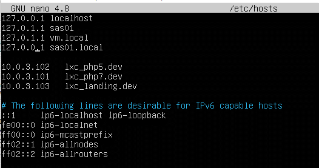

# Practical Report 1 - Server Administration System
Arranged by :
1. Chintya Tribhuana Utami (1202190041)
2. Nur Wulan Maudini (1202190002)

##### ______________________________________
The practicum is carried out based on the scheme listed in the questions and the questions can be accessed [Click here.](https://github.com/aldonesia/Sistem-Administrasi-Server-2021/blob/master/modul-1/soal_praktikum.md)
##### ______________________________________
In the implementation of working on practical questions, we make changes to the initial state of the previous practice questions with the practical questions that have been given this time.
##### ______________________________________
######
######
### Number 1. Rename ubuntu_php5.6 to ubuntu_landing, and change the IP following the new scheme
___
- Show the LXC before rename the LXC
    ```
    sudo lxc -ls -f
    ```  
    

- First stop the service on ubuntu_php5.6

  

- Rename ubuntu_php5.6 to ubuntu_landing

  

- Start service ubuntu_landing and then attach ubuntu_landing
    ```
    sudo lxc-start -n ubuntu_landing
    sudo lxc-attach -n ubuntu_landing
    ```  

  

- Change IP on LXC ubuntu_landing to 10.0.3.103

  

  

### Number 2. Install lxc debian 9 with the name debian_php5.6
- Check IP settings on the virtual machine

  

- Check if you can connect to the internet

  

- Add the following code to the ubuntu sources list
    ```
    sudo nano /etc/apt/sources.list
    ```
    
  
- Install LXC Debian 9
    ```
    sudo lxc-create -n debian_php5.5 -t download -- --dist debian --release stretch --arch amd64 --force-cache --no-validate --server images.linuxcontainers.org
    ```

  
  
- Update debian_php5.6

  
  
- Debian release information

  

### Number 3. setup nginx on debian_php5.6 for the domain http://lxc_php5.dev, create an index.html page that explains the lxc name information
- Exit ubuntu landing
    ```
    Exit
    ```
- Start and attach debian_php5.6 then install nginx and nginx extra on debian_php5.6
    ```
    sudo lxc-start -n debian_php5.6
    sudo lxc-attach -n debian_php5.6
    sudo apt install nginx nginx-extras
    ```
    

- Install curl and ip settings
    ```
    apt install nano net-tools curl
    nano /etc/network/interfaces
    ```

    

    
  
- Restart service networking
    ```
    systemctl restart networking.service
    ```
- Alternative if the IP is not changed:
    ```
    shutdown now
    sudo lxc-start -n debian_php5.6
    sudo lxc-attach -n debian_php5.6
    ```
  
- Check the IP whether it has changed or not using ifconfig
    
    
  
- Go to sites-available directory on nginx debian_php5.6
    ```
    cd /etc/nginx/sites-available
    ```
- Create a new file named lxc_php5.6.dev
    ```
    touch lxc_php5.6.dev
    ```
- Edit lxc_php5.6
    ```
    nano lxc_php5.6.dev
    ```
    

- Go to the sites-enabled directory on nginx debian_php5.6 to create a symlink to sites-available/lxc_php5.6
    ```
    cd ../sites-enabled
    ls
    ln -s /etc/nginx/sites-available/lxc_php5.6.dev
    ```
- Test nginx and restart the nginx service
    ```
    nginx -t
    nginx -s reload
    ```
    

- Setting hosts by going to the /etc/hosts directory
    ```
    nano /etc/hosts
    ```
  
- Add ip lxc_php5.dev same as localhost which is 127.0.0.1
    ```
    127.0.0.1   lxc_php5.dev
    ```
    

- Go to the var/www/html directory then create a new folder called lxc_php5.6
    ```
    cd /var/www/html
    ls
    mkdir lxc_php5.6
    ```
- Copy index.nginx-debian.html to a new file in the lxc_php5.6 folder with the name index.html
    ```
    cp index.nginx-debian.html lxc_php5.6/index.html lxc_php5.6/index.html
    cd /var/www/html/lxc_php5.6
    ```
    
  
- Edit the index in the lxc_php5.6 folder stating that 'This page is from lxc_debian5.6' and save
    ```
    nano index.html
    ```
    

- Check the contents of http lxc_php5.dev using curl from localhost lxc debian_php5.6
    ```
    curl -i http://lxc_php5.dev
    ```

  

### Number 4. setup nginx on ubuntu_landing for the http://lxc_landing.dev domain, create an index.html page that describes the lxc name information
- Exit the debian_php5.6 directory and then enter the ubuntu_landing directory
    ```
    exit
    sudo lxc-start -n ubuntu_landing
    sudo lxc-attach -n ubuntu_landing
    ```
  
- Go to sites-available and edit lxc_php5.6.dev
    ```
    cd ../sites-available
    nano lxc_php5.6.dev
    ```
    

- Edit the server name in sites-available/lxc_php5.6.dev to lxc_landing.dev
  Server name is the name of the server that will be called later

  

- Go to the sites-enabled directory display the contents of the folder and symlink it using:
    ```
    cd ../sites-enabled
    ls -la
    ```
  
- nginx test and reload nginx
    ```
    nginx -t
    nginx -s reload
    ```
    
  
- Setting hosts by going to the /etc/hosts directory and then changing the ip server name to 127.0.0.1 lxc_landing.dev

  

- Go to the html directory, then check the contents of the folder first 
    ```
    cd /var/www/html
    ls
    cd /var/www/html/lxc_php5.6/
    ```
    
  
  It is known that there is already a folder called lxc_php5.6 before then go to the directory of the folder and edit the index.html file in it
    ```
    nano index.html
    ```

- Change the contents of index.html to lxc name information 'This page is from lxc ubuntu_landing'

  

- Check the contents (http://lxc_landing.dev) on localhost lxc ubuntu_landing using curl
    ```
    curl -i http://lxc_landing.dev
    ```
    

### Number 5. LXC ubuntu_landing must auto start when the vm is turned on, this is used to keep the company profile website from experiencing downtime
- First exit from ubuntu_landing lxc directory then stop service ubuntu landing
    ```
    exit
    sudo lxc-stop -n ubuntu_landing
    ```
- Check service status ubuntu_landing to be stopped
    ```
    lxc-ls -f
    ```
    

- Enter root then go to directory /var/lib/lxc and go to directory ubuntu_landing/config
    ```
    sudo su
    cd /vsr/lib/lxc
    ls
    cd ubuntu_landing
    ls
    nano config
    ```

  
  
- Add autostart code 1
    ```
    lxc.start.auto = 1
    ```
    

- Check whether the autostart is correct to 1
    ```
    lxc-ls -f
    ```
    

### Number 6. setup nginx on vm.local to set proxy_pass where :
1. mengakses http://vm.local akan diarahkan ke http://lxc_landing.dev
2. mengakses http://vm.local/blog akan diarahkan ke http://lxc_php7.dev
3. mengakses http://vm.local/app akan diartahkan ke http://lxc_php5.dev

- Setting hosts on vm
  Add ip of debian_php5.6
  
  

- Edit vm.local at sites-available
    ```
    cd /etc/nginx/sites-available
    ls
    sudo nano vm.local
    ```

  
  
- Change proxy_pass
  - accessing http://vm.local will redirect to http://lxc_landing.dev :
    ```
    location / {
        rewrite /?(.*)$ /$1 break;
        proxy_pass http://lxc_landing.dev;
    }
    ```
  The rewrite function is to remove the back of /
  
  proxy_pass changed to http://lxc_landing.dev
  
  
  - accessing http://vm.local/blog will redirect to http://lxc_php7.dev :
    ```
    location /blog {
        rewrite /blog/?(.*)$ /$1 break;
        proxy_pass http://lxc_php7.dev
    }
    ```
  The rewrite function is to remove the back of /blog
  
  proxy_pass changed to http://lxc_php7.dev
  
  
  - accessing http://vm.local/app will redirect to http://lxc_php5.dev :
    ```
    location /app {
        rewrite /app/?(.*)$ /$1 break;
        proxy_pass http://lxc_php5.dev;
    }
    ```
    The rewrite function is to remove the back end of /app
    proxy_pass changed to http://lxc_php5.dev
    

- Enter sites-enabled reset nginx
  ```
  cd ../sites-enabled
  sudo nginx -t
  sudo nginx -s reload
  ```

  

### Number 7. For their presentation needs, the browser on their laptop must be able to access the three urls.
- Check locally in the vm if the link is working properly using curl
  ```
  curl -i http://vm.local/
  curl -i http://vm.local/app
  curl -i http://vm.local/blog
  ```
  
- Configure the hosts ip on the laptop to connect to the virtual box by opening notepad as admin and then opening hosts at C://windows/system32/driver/etc/hosts and adding the virtual box ip which is 192.168.43.100 with the server name vm.local

    

- Try on the browser
  - http://vm.local/

  
  
  - http://vm.local/app

  
  
  - http://vm.local/blog

  


### Soal 8. Menyiapkan analisa untuk diserahkan ke CTO
- why for php5.6 needs can't use ubuntu 16.04, so it needs to be changed to debian 9 os?
    - Because Ubuntu 16.04 xenial has reached the end of version and does not support php 5.6 in april 2021
- why use LXC virtualization on the website schema to be developed?
    - Using LXC virtualization makes it easy to create servers because the schema on the website uses different linux systems.
- what is a proxy server? why can we think of vm.local as a proxy server?
    - A proxy server is a computer server or computer program that can act as another computer to request content from the Internet or intranet. In general, proxy servers are used to secure private computer networks connected to public networks. So, from the proxy server, the server is usually placed between the application server and the client application, where the client application is a web browser, FTP client and others, while the server application is an FTP server and web server.
    - Vm.local as proxy server and web landing page. It means vm.local bridge to connect internet.
