# Practical Report 3 - Server Administration System
Arranged by :
1. Chintya Tribhuana Utami (1202190041)
2. Nur Wulan Maudini (1202190002)
#
The practicum is carried out based on the conditions stated in the questions and questions can be accessed [Click here.](https://github.com/aldonesia/Sistem-Administrasi-Server-2021/blob/master/modul-3/silabus.md)
#
In the implementation of working on practical questions, we made changes to the initial state of the previous practice questions with the practical questions that have been given this time.
#
Go to ~/ansible/module2-ansible , then create a roles/laravel folder containing tasks, templates, and handlers
```
cd ~/ansible/modul2-ansible
sudo mkdir -p roles/laravel/tasks
sudo mkdir -p roles/laravel/template
sudo mkdir -p roles/laravel/handlers
```
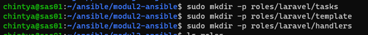
###
In ansible create setting-landing.yml containing :
###
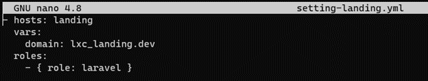
###
In Laravel/tasks/main.yml containing:
###

```
---
- name: delete apt chache
  become: yes
  become_user: root
  become_method: su
  command: rm -vf /var/lib/apt/lists/*

- name: install package tambahan
  become: yes
  become_user: root
  become_method: su
  apt: name={{ item }} state=latest update_cache=true
  with_items:
    - gtkhash
    - bind9
    - dnsutils
    - crack-md5
    - git
    - curl

- name: buat directori dev/landing
  file:
    path: /var/www/html/dev/landing
    state: directory

- name: copy named.conf.local
  template:
    src=template/named.conf.local
    dest=/var/www/html/dev/landing
  notify:
    - restart bind

- name: copy vm.local
  template:
    src=template/vm.local
    dest=/var/www/html/dev/landing
  notify:
    - restart bind

- name: copy 1.168.192 .in-addr.arpa
  template:
    src=template/1.168.192 .in-addr.arpa
    dest=/var/www/html/dev/landing
  notify:
    - restart bind

- name: copy resolv.conf
  template:
    src=template/resolv.conf
    dest=/etc/resolv.conf

- name: copy named.conf.options
  template:
    src=template/named.conf.options
    dest=/var/www/html/dev/landing
  notify:
    - restart bind
```
In Laravel/handlers/main.yml containing :
###
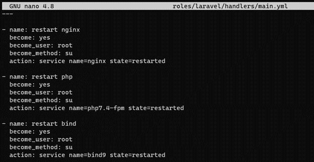
```
---

- name: restart nginx
  become: yes
  become_user: root
  become_method: su
  action: service name=nginx state=restarted

- name: restart php
  become: yes
  become_user: root
  become_method: su
  action: service name=php7.4-fpm state=restarted

- name: restart bind
  become: yes
  become_user: root
  become_method: su
  action: service name=bind9 state=restarted
```
In Laravel/template/named.conf.local containing :
###
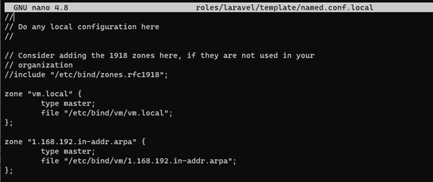
```
//
// Do any local configuration here
//

// Consider adding the 1918 zones here, if they are not used in your
// organization
//include "/etc/bind/zones.rfc1918";

zone "vm.local" {
        type master;
        file "/etc/bind/vm/vm.local";
};

zone "1.168.192 .in-addr.arpa" {
        type master;
        file "/etc/bind/vm/1.168.192 .in-addr.arpa";
};
```
In Laravel/template/vm.local containing :
###
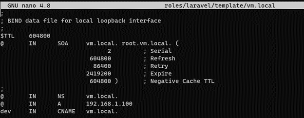
```
;
; BIND data file for local loopback interface
;
$TTL    604800
@       IN      SOA     vm.local. root.vm.local. (
                              2         ; Serial
                         604800         ; Refresh
                          86400         ; Retry
                        2419200         ; Expire
                         604800 )       ; Negative Cache TTL
;
@       IN      NS      vm.local.
@       IN      A       192.168.1.100 
dev     IN      CNAME   vm.local.
```
In Laravel/template/ 1.168.192 .in-addr.arpa containing :
###
 
```
;
; BIND data file for local loopback interface
;
$TTL    604800
@       IN      SOA     vm.local. root.vm.local. (
                              2         ; Serial
                         604800         ; Refresh
                          86400         ; Retry
                        2419200         ; Expire
                         604800 )       ; Negative Cache TTL
;
1.168.192.in-addr.arpa.  IN      NS      vm.local. ; IP VM dibalik tanpa byte ke 4
100                       IN      PTR     vm.local. ; byte ke 4 IP VM
```
In Laravel/template/resolv.conf containing :
###
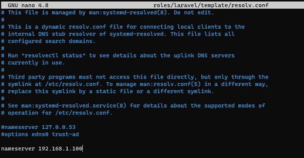
```
# This file is managed by man:systemd-resolved(8). Do not edit.
#
# This is a dynamic resolv.conf file for connecting local clients to the
# internal DNS stub resolver of systemd-resolved. This file lists all
# configured search domains.
#
# Run "resolvectl status" to see details about the uplink DNS servers
# currently in use.
#
# Third party programs must not access this file directly, but only through the
# symlink at /etc/resolv.conf. To manage man:resolv.conf(5) in a different way,
# replace this symlink by a static file or a different symlink.
#
# See man:systemd-resolved.service(8) for details about the supported modes of
# operation for /etc/resolv.conf.

#nameserver 127.0.0.53
#options edns0 trust-ad

nameserver 192.168.1.100 
```
In Laravel/template/named.conf.options containing :
###
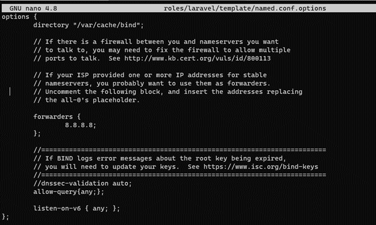
```    
options {
        directory "/var/cache/bind";

        // If there is a firewall between you and nameservers you want
        // to talk to, you may need to fix the firewall to allow multiple
        // ports to talk.  See http://www.kb.cert.org/vuls/id/800113

        // If your ISP provided one or more IP addresses for stable
        // nameservers, you probably want to use them as forwarders.
        // Uncomment the following block, and insert the addresses replacing
        // the all-0's placeholder.

        forwarders {
                8.8.8.8;
        };

        //========================================================================
        // If BIND logs error messages about the root key being expired,
        // you will need to update your keys.  See https://www.isc.org/bind-keys
        //========================================================================
        //dnssec-validation auto;
        allow-query{any;};

        listen-on-v6 { any; };
};
```
Run
###
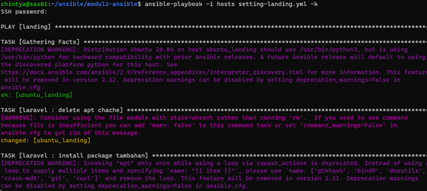
###
Add dev.vm.local di /etc/hosts
###
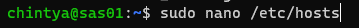
###

###
Go to /var/www/html/dev/landing in lxc_landing, then edit vm.local to
###

###

###
Then restart the bind9 service
###
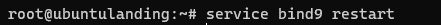
###
Edit vm.local di sites available

###
Don't forget to restart nginx
```
sudo nginx -t
sudo nginx -s reload
```
Change DNS in control panel
###
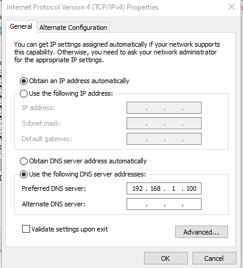
###
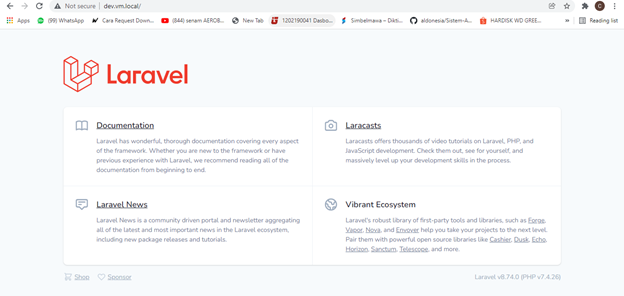
###
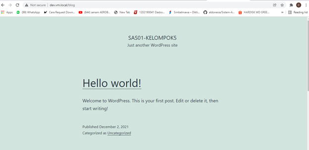
###

