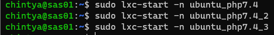
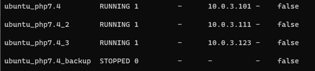

# Practical Report 4 - Server Administration System
Arranged by :
1. Chintya Tribhuana Utami (1202190041)
2. Nur Wulan Maudini (1202190002)
#
The practicum is carried out based on the conditions stated in the questions and questions can be accessed [Click here.](https://github.com/aldonesia/Sistem-Administrasi-Server-2021/blob/master/modul-4/silabus.md)
#
In the implementation of working on practical questions, we made changes to the initial state of the previous practice questions with the practical questions that have been given this time.
#
Duplicate debian_php5.6

Go to debian_php5.6_2

Edit file /etc/network/interfaces , change IP address to 10.0.3.112

Then do the following command

Register lxc_php5_2.dev at /etc/hosts

Change the server_name to lxc_php5_2.dev

Restart nginx, then run the curl command

Register lxc_php5_2.dev at /etc/hosts on vm

Go to root debian_php5.6_3

Edit file /etc/network/interfaces, change the IP address to 10.0.3.122

Then do the following command

Register lxc_php5_3.dev at /etc/hosts

Change the server_name to lxc_php5_3.dev

Restart nginx, then run the curl command

Register lxc_php5_2.dev at /etc/hosts on vm

Check the lxc list whether the IP has changed or not

#
Duplicate ubuntu_php7.4

Go to root ubuntu_php7.4_2

Edit file /etc/netplan/10-lxc.yaml , Change the IP address to 10.0.3.111

Then do the following command

Register lxc_php7_2.dev pada /etc/hosts

Change the server_name to lxc_php7_2.dev

Restart nginx, then run the curl command

Register lxc_php7_2.dev at /etc/hosts on vm

Go to root ubuntu_php7.4_3

Edit file /etc/netplan/10-lxc.yaml , change the IP address to 10.0.3.123

Then do the following command

Register lxc_php7_3.dev at /etc/hosts

Change the server_name to lxc_php7_3.dev

Restart nginx, then run the curl command

Register lxc_php7_3.dev at /etc/hosts on vm

Check the lxc list whether the IP has changed or not

#
Difference between /, /app, /blog and loadbalancer
Jmeter with 50 users using load balancing
###

###
Jmeter with 100 users using load balancing
###

###
Jmeter with 150 users using loadbalancing
###

###
Here Jmeter uses 50 users without using loadbalancing
###

###
Here Jmeter uses 100 users without using loadbalancing
###

###
Here Jmeter uses 150 users without using loadbalancing
###

#
## Analysis
Below is the results from when we use load balancer and not using the load balancer
- When there is 50 users that access our web, if we don't use load balancer the average time of user accessing our web is
    - landing : 1580 ms = 0.158 s
    - blog : 1330 ms = 1.33 s
    - app :  5 ms = 0.005 s
- When we use load balancer, then
    - landing :  46 ms =  0.046 s
    - blog :  60 ms = 0.06 s
    - app :  43 ms = 0.043 s
#
- When there is 100 users that access our web, if we don't use load balancer the average time of user accessing our web is
    - landing :  2760 ms = 2.76 s
    - blog :  2431 ms = 2.431 s
    - app : 5 ms = 0.005 s
-   When we use load balancer, then
    - landing : 111 ms = 0.111 s
    - blog : 151 ms = 0.151 s
    - app : 88 ms = 0.088 s
#
- When there is 150 users that access our web, if we don't use load balancer the average time of user accessing our web is
    - landing : 3763 ms = 3.763 s
    - blog : 3410 ms = 3.41 s
    - app :  4 ms = 0.004 s
- When we use load balancer, then
    - landing : 293 ms = 0.293 s
    - blog : 146 ms = 0.146 s
    - app : 134 ms = 0.134 s
#
Here we can know that the average time of user accessing our web is faster then if we don't use load balancer. For the throughput or the amount of user accessing our web is
- When there is 50 users that access our web, if we don't use load balancer the amount of user accessing our web is
    - landing :  17 user / second
    - blog :  12 user / second
    - app :  18 user / second
- When we use load balancer, then
    - landing : 450 user / second
    - blog : 226 user / second
    - app : 298 user / second 
#
- When there is 100 users that access our web, if we don't use load balancer the amount of user accessing our web is
    - landing :  19 user / second
    - blog :  13 user / second
    - app :  20 user / second
- When we use load balancer, then
    - landing : 363 user / second
    - blog : 178 user / second
    - app : 270 user / second
#
- When there is 150 users that access our web, if we don't use load balancer the amount of user accessing our web is
    - landing : 21 user / second
    - blog : 13 user / second
    - app :  22 user / second
- When we use load balancer, then
    - landing : 137 user / second
    - blog : 153 user / second
    - app : 139 user / second

In conclusion, the average user accesses their website 1 second faster and significantly using a load balancer and also the number of users who access is more than those who do not use a load balancer.
