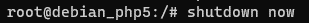
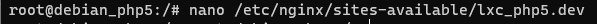
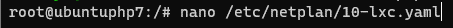
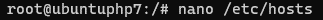

# Practical Report 3 - Server Administration System
Arranged by :
1. Chintya Tribhuana Utami (1202190041)
2. Nur Wulan Maudini (1202190002)
#
The practicum is carried out based on the conditions stated in the questions and questions can be accessed [Click here.](https://github.com/aldonesia/Sistem-Administrasi-Server-2021/blob/master/modul-3/silabus.md)
#
In the implementation of working on practical questions, we made changes to the initial state of the previous practice questions with the practical questions that have been given this time.
#

