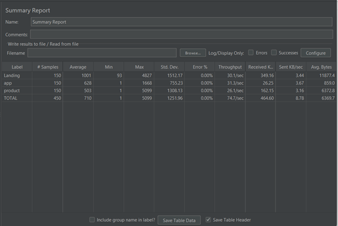
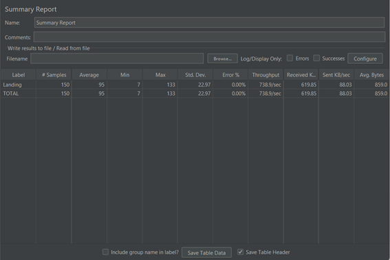
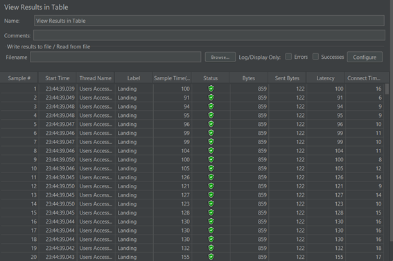

# Laporan Praktikum 4 - Sistem Administrasi Server 
Disusun oleh :
1. Chintya Tribhuana Utami (1202190041)
2. Nur Wulan Maudini (1202190002)
#
Praktikum dilaksanakan berdasarkan keadaan yang tertera pada soal dan soal dapat diakses [Klik disini.](https://github.com/aldonesia/Sistem-Administrasi-Server-2021/blob/master/modul-4/silabus.md)
#
Dalam pelaksanaan mengerjakan soal-soal praktikum, kami melakukan perubahan keadaan awal dari soal-soal latihan sebelumnya dengan soal-soal praktikum yang telah diberikan kali ini.
#
Duplicate debian_php5.6

Masuk ke root debian_php5.6_2

Edit file /etc/network/interfaces , ubah IP address menjadi 10.0.3.112

Kemudian lakukan perintah berikut

Registrasi lxc_php5_2.dev pada /etc/hosts

Ubah server_name menjadi lxc_php5_2.dev

Restart nginx, lalu jalankan perintah curl

Registrasi lxc_php5_2.dev pada /etc/hosts di vm

Masuk ke root debian_php5.6_3

Edit file /etc/network/interfaces , ubah IP address menjadi 10.0.3.122

Kemudian lakukan perintah berikut

Registrasi lxc_php5_3.dev pada /etc/hosts

Ubah server_name menjadi lxc_php5_3.dev

Restart nginx, lalu jalankan perintah curl

Registrasi lxc_php5_2.dev pada /etc/hosts di vm

Cek list lxc apakah IP sudah berubah atau belum

#
Duplicate ubuntu_php7.4

Masuk ke root ubuntu_php7.4_2

Edit file /etc/netplan/10-lxc.yaml , ubah IP address menjadi 10.0.3.111

Lalu jalankan perintah berikut

Registrasi lxc_php7_2.dev pada /etc/hosts

Ubah server_name menjadi lxc_php7_2.dev

Restart nginx, lalu jalankan perintah curl

Registrasi lxc_php7_2.dev pada /etc/hosts di vm

Masuk ke root ubuntu_php7.4_3

Edit file /etc/netplan/10-lxc.yaml , ubah IP address menjadi 10.0.3.123

Lalu jalankan perintah berikut

Registrasi lxc_php7_3.dev pada /etc/hosts

Ubah server_name menjadi lxc_php7_3.dev

Restart nginx, lalu jalankan perintah curl

Registrasi lxc_php7_3.dev pada /etc/hosts di vm

Cek list lxc apakah IP sudah berubah atau belum

#
Perbedaan antara /, /app, /blog dengan loadbalancer   
Jmeter dengan 50 user menggunakan load balancing
###

###
Jmeter dengan 100 user menggunakan load balancing
###

###
Jmeter dengan 150 user menggunakan loadbalancing
###

###
Berikut ini Jmeter menggunakan 50 user tanpa menggunakan loadbalancing
###

###
Berikut ini Jmeter menggunakan 100 user tanpa menggunakan loadbalancing
###

###
Berikut ini Jmeter menggunakan 150 user tanpa menggunakan loadbalancing
###

#
## Analisis
Di bawah ini adalah hasil dari saat kita menggunakan load balancer dan tidak menggunakan load balancer.
- Saat ada 50 user yang mengakses web kita, jika kita tidak menggunakan load balancer rata-rata waktu user mengakses web kita adalah
    - landing : 1580 ms = 0.158 s
    - blog : 1330 ms = 1.33 s
    - app :  5 ms = 0.005 s
- Saat kita menggunakan load balancer, maka
    - landing :  46 ms =  0.046 s
    - blog :  60 ms = 0.06 s
    - app :  43 ms = 0.043 s
#
- Saat ada 100 user yang mengakses web kita, jika kita tidak menggunakan load balancer rata-rata waktu user mengakses web kita adalah
    - landing :  2760 ms = 2.76 s
    - blog :  2431 ms = 2.431 s
    - app : 5 ms = 0.005 s
- Saat kita menggunakan load balancer, maka
    - landing : 111 ms = 0.111 s
    - blog : 151 ms = 0.151 s
    - app : 88 ms = 0.088 s
#
- Saat ada 150 user yang mengakses web kita, jika kita tidak menggunakan load balancer rata-rata waktu user mengakses web kita adalah
    - landing : 3763 ms = 3.763 s
    - blog : 3410 ms = 3.41 s
    - app :  4 ms = 0.004 s
- Saat kita menggunakan load balancer, maka
    - landing : 293 ms = 0.293 s
    - blog : 146 ms = 0.146 s
    - app : 134 ms = 0.134 s
#
Disini kita dapat mengetahui bahwa rata-rata waktu pengguna mengakses web kita lebih cepat dibandingkan jika kita tidak menggunakan load balancer. Untuk throughput atau jumlah pengguna yang mengakses web kami adalah
- Ketika ada 50 pengguna yang mengakses web kami, jika kami tidak menggunakan penyeimbang beban, jumlah pengguna yang mengakses web kami adalah
    - landing :  17 user / second
    - blog :  12 user / second
    - app :  18 user / second
- Saat kita menggunakan load balancer, maka
    - landing : 450 user / second
    - blog : 226 user / second
    - app : 298 user / second
#
- Ketika ada 100 pengguna yang mengakses web kami, jika kami tidak menggunakan penyeimbang beban, jumlah pengguna yang mengakses web kami adalah
    - landing :  19 user / second
    - blog :  13 user / second
    - app :  20 user / second
- Saat kita menggunakan load balancer, maka
    - landing : 363 user / second
    - blog : 178 user / second
    - app : 270 user / second
#
- Ketika ada 150 pengguna yang mengakses web kami, jika kami tidak menggunakan penyeimbang beban, jumlah pengguna yang mengakses web kami adalah
    - landing : 21 user / second
    - blog : 13 user / second
    - app :  22 user / second
- Saat kita menggunakan load balancer, maka
    - landing : 137 user / second
    - blog : 153 user / second
    - app : 139 user / second

Kesimpulannya, rata-rata user mengakses website nya lebih cepat 1detik dan signifikan menggunakan load balancer dan juga jumlah user yang mengakses lebih banyak daripada tidak menggunakan load balancer.